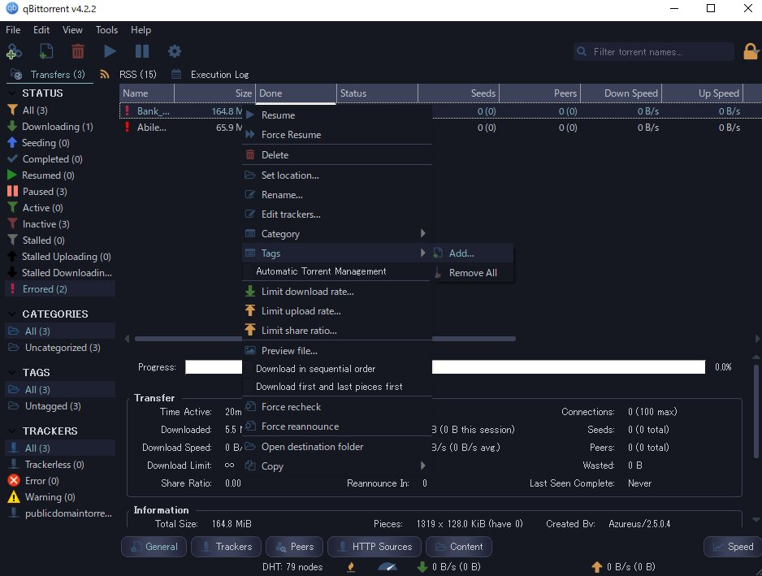

# qBittorrent Dark theme
Derived from: [**jagannatharjun**/qbt-theme/material](https://github.com/jagannatharjun/qbt-theme)

**ICEBURG.qbtheme** 

Color Sample : [Solarized](https://github.com/altercation/solarized#solarized) / [ICEBERG](https://github.com/cocopon/iceberg.vim#readme) / [ayu](https://github.com/dempfi/ayu#screenshots)

## Usage
Download the ZIP (green button) or individual RAW `.qbtheme` files. Please use Theme function in Options.

## Q&A
Please use [this place](https://github.com/maboroshin/qBittorrentDarktheme/issues/1).

* Torrents for testing: [Public Domain Torrents](https://www.publicdomaintorrents.info/)

## Known issue
*[More info: Issues waiting for release 4.22](https://github.com/maboroshin/qBittorrentDarktheme/issues/2)* 
*[More info2: Unknown issue](https://github.com/maboroshin/qBittorrentDarktheme/issues/3)*

Probably cannot be changed in the theme file.
- Progress bar color fixed.
- Link color fixed to blue.
- strangeness of check items, In right-click transfer list.

## Compile
*[More info...](https://github.com/maboroshin/qBittorrentDarktheme/wiki/How-to-compile-.qbtheme)*

Rename `src\stylesheet~~.qss`  to `src\stylesheet.qss`, and compile `resources.qrc` by Qt rcc.

## License
[Jagannatharjun says](https://github.com/qbittorrent/qBittorrent/issues/6434#issuecomment-581101910):
> none of the stylesheets belongs to me 
>just google search the style name without .qbttheme + github suffix 
>I just pack it around for testing the theme support when I was implementing it 
>I'll be mentioning this in the repo just that I'm bit busy with college and stuff

He created the .qbttheme for qBittorrent. So I think it's not copyrightable or means public domain. However, `stylesheet.qss` is similar to QDarkStyleSheet. License inheritance may be necessary.

- [qBittorrent: Icons by Code Charm: MIT License](https://github.com/qbittorrent/qBittorrent/blob/master/src/icons/qbt-theme/README.md).
- [(Used Icons, stylesheet.qss) QDarkStyleSheet by Colin Duquesnoy et al: MIT and CCBY4.0 License](https://github.com/ColinDuquesnoy/QDarkStyleSheet).
